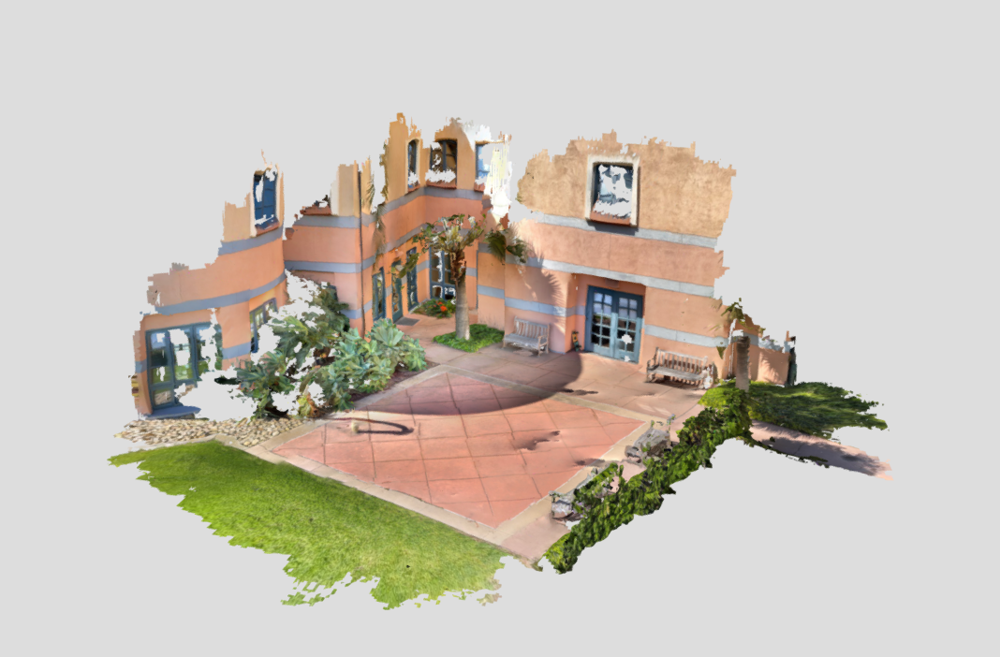
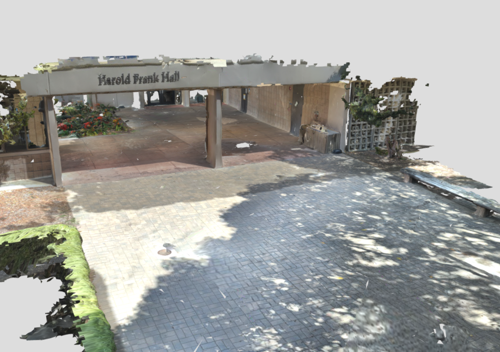
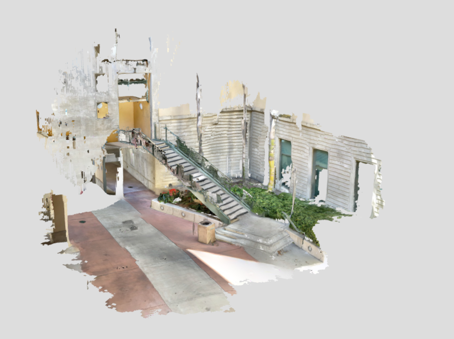
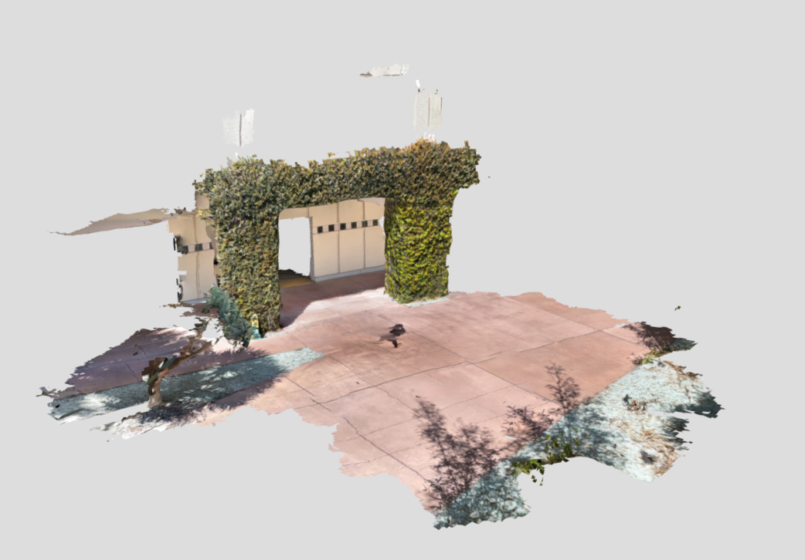
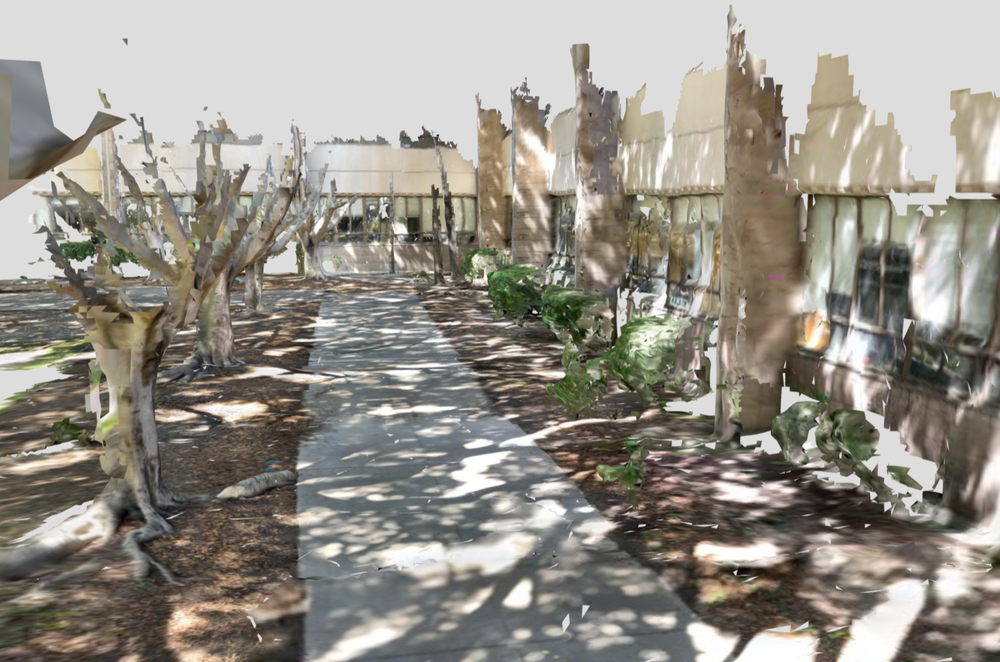

# 3D Scan Dataset
Collection of 3D scans with textured mesh, camera parameters, raw RGB and depth gathered using [**3D Scanner App**](https://www.3dscannerapp.com/)

## Scenes

[](https://sketchfab.com/3d-models/kohn-hall-ucsb-46c950c803bc4ba6855c74cce95bb5ec)

*A corner of the Kohn Hall- UCSB* -  [**Download**](https://drive.google.com/file/d/11aVT_SL_NKOAfONzAcjNoODic7BMyWRV/view?usp=sharing)

[](https://sketchfab.com/3d-models/harold-frank-hall-ucsb-02f960c7a26343ee816b643aedaeb0b4)

*HFH Entrance - UCSB* - [**Download**](https://drive.google.com/file/d/1g7pCB0Vpt632T7kj-25GvWymINfuk4bS/view?usp=sharing)

[](https://sketchfab.com/3d-models/marine-sciences-staris-ucsb-f034d249c05c436d8e7e68970ea227b0)

*Marine Sciences - UCSB* - [**Download**](https://drive.google.com/file/d/11xPCM6d0kK4cstfh2Oma8w96y8OnD4WV/view?usp=sharing)

[](https://sketchfab.com/3d-models/elings-hall-courtyard-ucsb-4bc868d2d09644bc822d011acb43e8da)

*Elings Hall - UCSB* - [**Download**](https://drive.google.com/file/d/12vWCDb-WmRozpC3KhXOZOjyIejWzSl8I/view?usp=sharing)

[](https://skfb.ly/onn8C)

*Bio Backyard - UCSB* - [**Download**](https://drive.google.com/file/d/1ZgJ0yw0-Xv7r3H3n6yB6gff5HHaHRAIG/view?usp=sharing)


## Citing
If you used this dataset in your research please cite us.

```bibtex
@misc{mobile3dscandataset,
    author = {Ehsan Sayyad},
    title = {{Mobile 3D scan dataset}},
    year = {2021},
    publisher = {GitHub},
    journal = {GitHub repository},
    howpublished = {\url{https://GitHub.com/ehsuun/3DScanDataset}},
}
```
