# 3D Scan Dataset
Collection of 3D scans with textured mesh, camera parameters, raw RGB and depth gathered using [**3D Scanner App**](https://www.3dscannerapp.com/)

## Download

You can download the entire dataset from <a href="https://drive.google.com/drive/folders/1rRj1ngwwgzlQz2OzhlsorodbgjHnZWvA?usp=sharing">here</a>.

Individual scenes can be viewed and downloaded from the table below.

## Scenes


<table>
  <tr>
    <td>
    <a href="https://sketchfab.com/3d-models/kohn-hall-ucsb-46c950c803bc4ba6855c74cce95bb5ec">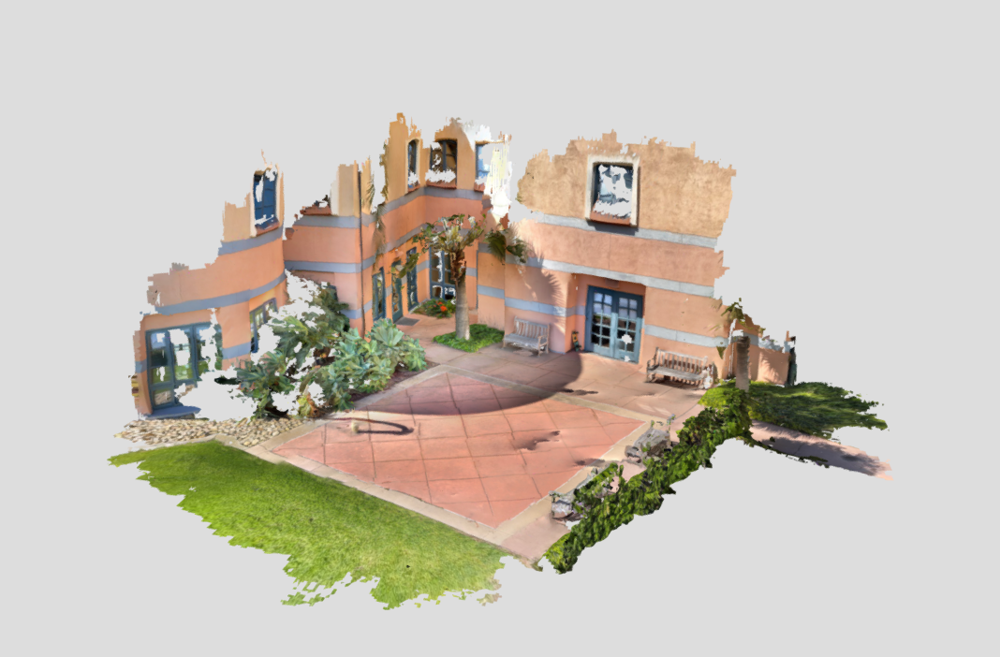</a>
    Kohn Hall, UCSB <a href="https://drive.google.com/file/d/11aVT_SL_NKOAfONzAcjNoODic7BMyWRV/view?usp=sharing">  Download </a>
    </td>
    <td>
    <a href="https://sketchfab.com/3d-models/harold-frank-hall-ucsb-02f960c7a26343ee816b643aedaeb0b4">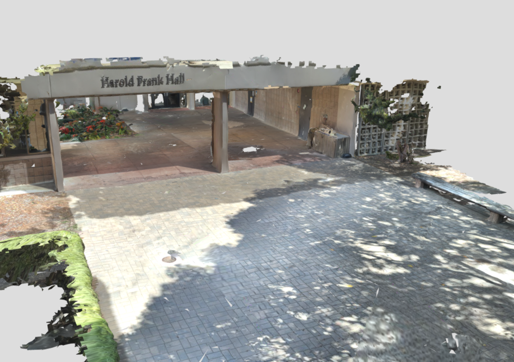</a>
    HFH Entrance, UCSB <a href="https://drive.google.com/file/d/1g7pCB0Vpt632T7kj-25GvWymINfuk4bS/view?usp=sharing">  Download </a>
    </td>
    <td>
    <a href="https://sketchfab.com/3d-models/marine-sciences-staris-ucsb-f034d249c05c436d8e7e68970ea227b0">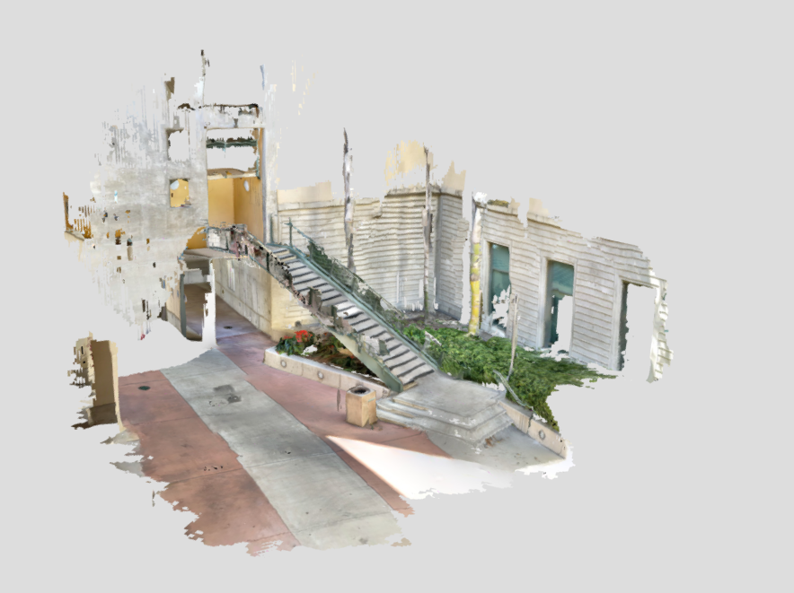</a>
    Marine Sciences, UCSB <a href="https://drive.google.com/file/d/11xPCM6d0kK4cstfh2Oma8w96y8OnD4WV/view?usp=sharing">  Download </a>
    </td>
   </tr> 
   <tr>
    <td>
    <a href="https://sketchfab.com/3d-models/elings-hall-courtyard-ucsb-4bc868d2d09644bc822d011acb43e8da">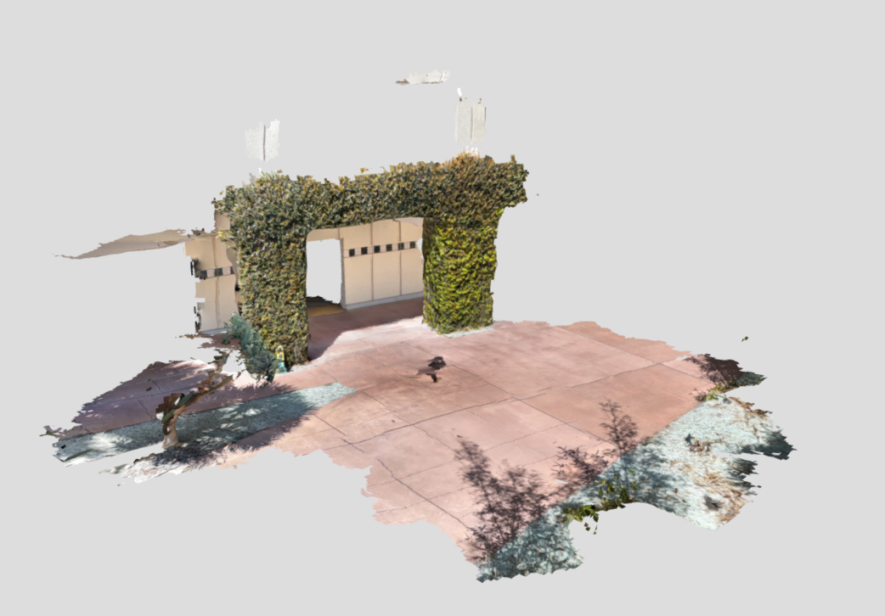</a>
    Elings Hall, UCSB <a href="https://drive.google.com/file/d/12vWCDb-WmRozpC3KhXOZOjyIejWzSl8I/view?usp=sharing">  Download </a>
    </td>
        <td>
    <a href="https://skfb.ly/onn8C">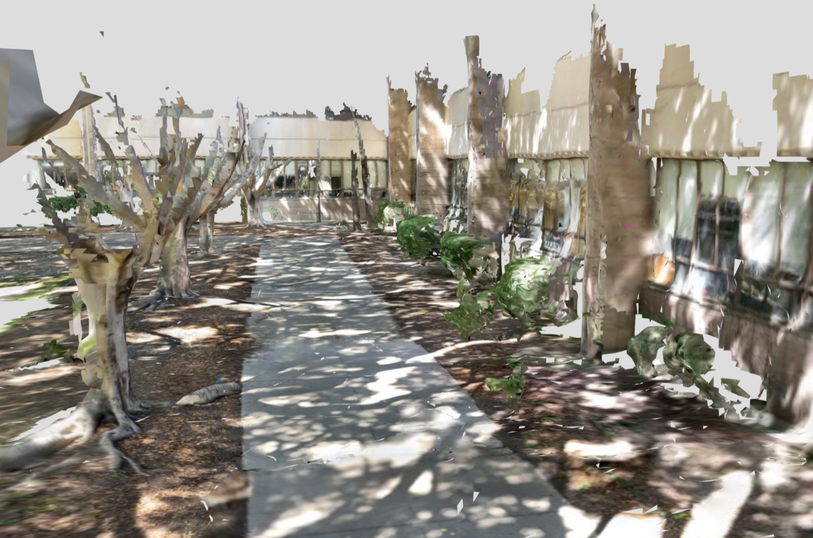</a>
    Bio Backyard, UCSB <a href="https://drive.google.com/file/d/1ZgJ0yw0-Xv7r3H3n6yB6gff5HHaHRAIG/view?usp=sharing">  Download </a>
    </td>
        <td>
    <a href="https://sketchfab.com/3d-models/beach-stairs-0a2d759eb3db4d48b422b3c24df732bd">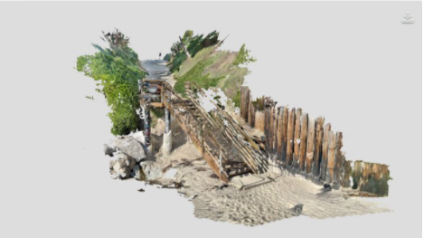</a>
    Beach Stairs, Isla Vista <a href="https://drive.google.com/file/d/1drKjNok7fx-1W_ORwGGJN8DlUBUgebMd/view?usp=sharing">  Download </a>
    </td>
  </tr>
     <tr>
    <td>
    <a href="https://sketchfab.com/3d-models/storefront-4162ba43514a47e6948b68a11ced64a0">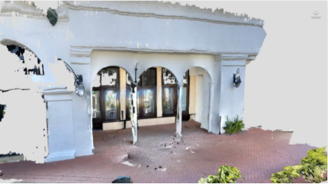</a>
    Storefront, Santa Barbara <a href="https://drive.google.com/file/d/1k36UJ97MSROvmeAtzSV077s3PeDsZ5HJ/view?usp=sharing">  Download </a>
    </td>
        <td>
    <a href="https://sketchfab.com/3d-models/waterfall-1b5b5227d8714136b0b25810b7f65412">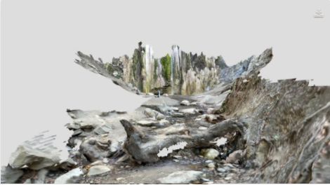</a>
    Waterfall, Santa Barbara <a href="https://drive.google.com/file/d/1ApsrOCP7_LGBEUxJ1JWUoLNB7WgYP6EA/view?usp=sharing">  Download </a>
    </td>
            <td>
    <a href="https://sketchfab.com/3d-models/creek-2c88fb778e2c494fb749631fcff5e1f4">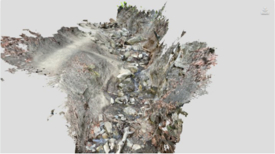</a>
    Creek, Santa Barbara <a href="https://drive.google.com/file/d/12FYdvUN72N8T8daoB0nHNO299ML-80Xh/view?usp=sharing">  Download </a>
    </td>
  </tr>
    <tr>
    <td>
    <a href="https://sketchfab.com/3d-models/rock-1-ac702e73f8124c87a792c586aaca49e1">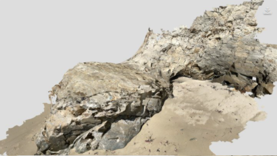</a>
    Rocks 1 <a href="https://drive.google.com/file/d/1P2KuQAm3qbaQREcXmUjDnFRXLsBaSZzD/view?usp=sharing">  Download </a>
    </td>
        <td>
    <a href="https://sketchfab.com/3d-models/beach-rock-rubble-13835c3280f343739e7021290fcb938e">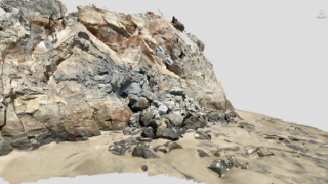</a>
    Rocks 2 <a href="https://drive.google.com/file/d/1dmP0MrboluBtkQvrM8PXLx-CJWsQF5gj/view?usp=sharing">  Download </a>
    </td>
    <td>
    <a href="https://sketchfab.com/3d-models/beach-rock-wall-d944d9c8bd604a7690a6a6b094f64298">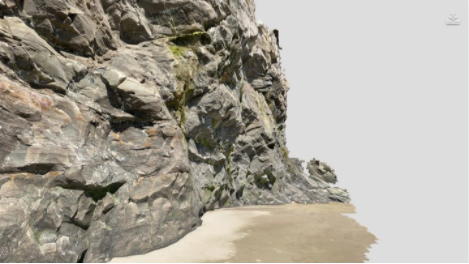</a>
    Rocks 3 <a href="https://drive.google.com/file/d/1BwiKJdI8wGMdUX4as0aYNUg0E7tVuG3J/view?usp=sharing">  Download </a>
    </td>
  </tr>

</table>


## Citing
If you used this dataset in your research please cite it using the following bibtex:

```bibtex
@misc{mobile3dscandataset,
    author = {Ehsan Sayyad},
    title = {{Mobile 3D scan dataset}},
    year = {2021},
    publisher = {GitHub},
    journal = {GitHub repository},
    howpublished = {\url{https://GitHub.com/ehsuun/3DScanDataset}},
}
```
